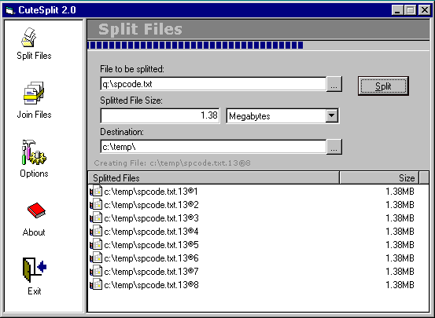



## CuteSplit 2\.0

### Description

The first version of this tool was posted on January 2001 which was supposed to split only text files with fixed record length, but i got some harsh response for that and i was asked if i can spice it up.

So here is the spicy version called CuteSplit.

CuteSplit allows you to split any type of file and join them back, it is the fastest and accurate file splitter tool you have ever seen, just pure VB codes and best of all it is free with source code for VB community.

CuteSplit is very easy to use. Browse for a file and select from several popular split sizes to begin the process. To join splitted files just locate the first splitted file.

You can send output to a folder of your choice or write the pieces directly to floppies.

So if you are still not happy just let me know i can make it spicier, but please vote.
 
### More Info
 

             |
---                |---
**Submitted On**   |2001-01-16 10:30:28
**By**             |[Rohullah Habibi](https://github.com/Planet-Source-Code/PSCIndex/blob/master/ByAuthor/rohullah-habibi.md)
**Level**          |Advanced
**User Rating**    |4.9 (276 globes from 56 users)
**Compatibility**  |VB 5\.0, VB 6\.0
**Category**       |[Complete Applications](https://github.com/Planet-Source-Code/PSCIndex/blob/master/ByCategory/complete-applications__1-27.md)
**World**          |[Visual Basic](https://github.com/Planet-Source-Code/PSCIndex/blob/master/ByWorld/visual-basic.md)
**Archive File**   |[CODE\_UPLOAD138341162001\.zip](https://github.com/Planet-Source-Code/rohullah-habibi-cutesplit-2-0__1-14461/archive/master.zip)

